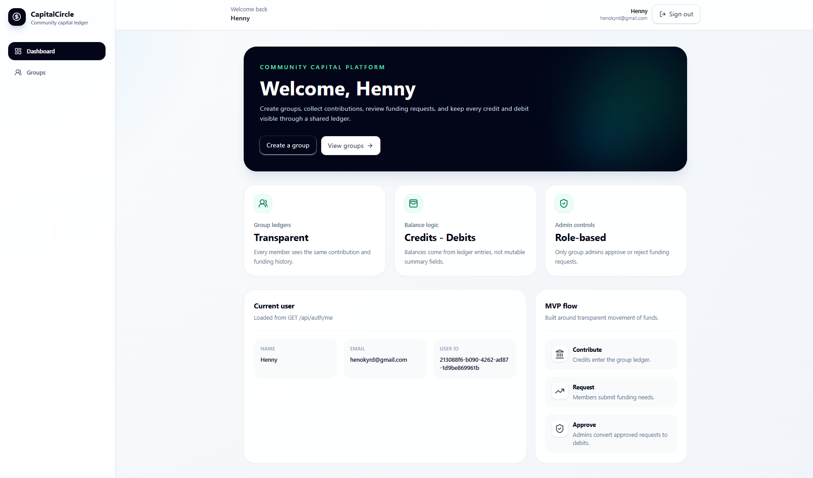
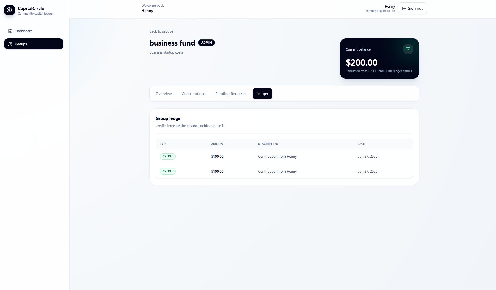

# CapitalCircle

CapitalCircle is a full-stack fintech/community finance platform for managing savings groups, pooled contributions, funding requests, and transparent group ledgers.

## Problem Statement

Community savings groups and informal investment circles often rely on spreadsheets, chat threads, or manual record keeping. That makes it difficult to answer basic trust-building questions: who contributed, what was approved, where funds moved, and what the group balance should be.

CapitalCircle solves this with a simple digital workflow: members join capital groups, record contributions, submit funding requests, and view an auditable ledger where every balance is calculated from immutable credit and debit entries.

## Core Features

- JWT-based registration, login, and protected dashboard access.
- Capital group creation with admin/member roles.
- Group membership and duplicate-join prevention.
- Contributions that automatically create `CREDIT` ledger entries.
- Funding requests that start as `PENDING` and can be approved or rejected by admins.
- Approved funding requests that automatically create `DEBIT` ledger entries.
- Balance calculation from ledger entries: credits minus debits.
- Clean React dashboard with cards, tables, forms, loading states, empty states, and status badges.
- Swagger/OpenAPI documentation for backend APIs.
- Dockerized PostgreSQL and Spring Boot backend.

## Tech Stack

| Layer | Technologies |
| --- | --- |
| Backend | Java 21, Spring Boot 3, Spring Web, Spring Security, JWT, Spring Data JPA, Validation, Lombok |
| Database | PostgreSQL, Flyway migrations |
| Frontend | React, TypeScript, Vite, React Router, Axios, Tailwind CSS |
| API Docs | Swagger/OpenAPI via Springdoc |
| Infrastructure | Docker, Docker Compose |
| Testing | Spring Boot tests, MockMvc, H2 test profile, Maven Docker image |

## Architecture Overview

CapitalCircle is organized as a monorepo with separate backend and frontend applications.

```text
capital-circle/
|-- backend/        # Spring Boot REST API, domain logic, persistence, tests
|-- frontend/       # React TypeScript Vite app
|-- docs/           # Screenshots and supporting portfolio assets
|-- docker-compose.yml
+-- README.md
```

The frontend communicates with the backend through REST APIs using Axios. Authentication is handled with JWTs stored in `localStorage` and sent as `Authorization: Bearer <token>`.

The backend uses controller, service, repository, DTO, and domain layers. Business rules live in the service layer, while Flyway owns database schema creation. Ledger entries are the source of truth for group balances.

## Backend Features

- REST API built with Spring Boot 3 and Java 21.
- Stateless Spring Security authentication with JWT.
- Password hashing with BCrypt.
- DTO-based request and response models.
- Service-layer business rules for membership, admin authorization, contributions, funding requests, and ledger activity.
- PostgreSQL persistence through Spring Data JPA.
- Flyway migration for the initial domain schema.
- Swagger UI available at `http://localhost:8080/swagger-ui.html`.
- Integration tests covering core business flows.

## Frontend Features

- React TypeScript app built with Vite.
- Protected routes with automatic redirect to login when no token exists.
- Register and login screens that persist JWTs in `localStorage`.
- Dashboard that loads the current user from `GET /api/auth/me`.
- Groups list and create-group flow using `contributionGoal`.
- Group detail page with tabs for overview, contributions, funding requests, and ledger.
- Fintech-style UI with responsive layout, cards, tables, forms, badges, loading states, error states, and empty states.
- Axios API client with automatic Bearer token header.

## Domain Model

- `User`: registered platform user with email, name, and password hash.
- `CapitalGroup`: a community capital group with a creator and optional contribution goal.
- `GroupMember`: joins a user to a group with either `ADMIN` or `MEMBER` role.
- `Contribution`: money contributed by a member into a group.
- `FundingRequest`: member request for funds with `PENDING`, `APPROVED`, or `REJECTED` status.
- `LedgerEntry`: financial record for a group, either `CREDIT` or `DEBIT`.

Key domain rules:

- Every contribution creates a `CREDIT` ledger entry.
- Every approved funding request creates a `DEBIT` ledger entry.
- Rejected funding requests do not create ledger entries.
- Group balance is calculated from ledger entries.
- Only group admins can approve or reject funding requests.
- Approval is blocked when the group balance is insufficient.

## API Overview

Auth:

- `POST /api/auth/register`
- `POST /api/auth/login`
- `GET /api/auth/me`

Groups:

- `POST /api/groups`
- `GET /api/groups`
- `GET /api/groups/{id}`
- `POST /api/groups/{id}/join`

Contributions:

- `POST /api/groups/{groupId}/contributions`
- `GET /api/groups/{groupId}/contributions`

Funding requests:

- `POST /api/groups/{groupId}/funding-requests`
- `GET /api/groups/{groupId}/funding-requests`
- `POST /api/funding-requests/{requestId}/approve`
- `POST /api/funding-requests/{requestId}/reject`

Ledger:

- `GET /api/groups/{groupId}/ledger`
- `GET /api/groups/{groupId}/balance`

## Run Locally With Docker

Prerequisites:

- Docker Desktop
- Node.js and npm for the frontend

Start PostgreSQL and the backend:

```bash
docker compose up --build
```

Backend:

```text
http://localhost:8080
```

Swagger UI:

```text
http://localhost:8080/swagger-ui.html
```

PostgreSQL:

```text
localhost:5432
database: capitalcircle
username: capitalcircle
password: capitalcircle
```

## Run Frontend Locally

In a second terminal:

```bash
cd frontend
npm install
npm run dev
```

Frontend:

```text
http://localhost:5173
```

The frontend calls `http://localhost:8080` by default. To override the API URL:

```bash
cd frontend
cp .env.example .env
```

Then update:

```text
VITE_API_BASE_URL=http://localhost:8080
```

## Run Backend Tests With Docker Maven Image

If Maven is not installed locally, run the backend test suite through Docker:

```bash
cd backend
docker run --rm -v "${PWD}:/app" -w /app maven:3.9-eclipse-temurin-21 mvn test
```

PowerShell version:

```powershell
cd backend
$workdir = (Get-Location).Path; docker run --rm -v "${workdir}:/app" -w /app maven:3.9-eclipse-temurin-21 mvn test
```

The tests use a Spring `test` profile with H2 and cover the core flows: auth, group admin creation, duplicate joins, contributions, ledger credits, funding request status, admin approval, ledger debits, rejection behavior, and insufficient balance blocking.

## Screenshots

Add screenshots to `docs/screenshots/` using these paths:

```text
docs/screenshots/dashboard.png
docs/screenshots/groups.png
docs/screenshots/group-overview.png
docs/screenshots/contributions.png
docs/screenshots/funding-requests.png
docs/screenshots/ledger.png
```

Suggested README embeds:

```md



```

## Demo User Flow

1. Register a new account.
2. Log in and land on the protected dashboard.
3. Create a capital group with a `contributionGoal`.
4. Open the group detail page and review the starting balance.
5. Add a contribution and confirm that the balance increases.
6. Open the ledger tab and confirm a `CREDIT` entry was created.
7. Create a funding request and confirm it starts as `PENDING`.
8. Approve the request as the group admin.
9. Confirm that the ledger shows a `DEBIT` entry and the balance decreases.
10. Create another funding request and reject it to confirm no ledger entry is created.

## Future Improvements

- Invite links and email-based group invitations.
- Member contribution schedules and recurring contribution reminders.
- Funding request comments and voting.
- Audit history for admin decisions.
- Pagination and filtering for ledger-heavy groups.
- Role management for promoting or removing admins.
- Production deployment with managed PostgreSQL and CI/CD.
- End-to-end browser tests with Playwright or Cypress.

## Portfolio / Resume Bullet

Built `CapitalCircle`, a full-stack fintech/community finance platform using Java 21, Spring Boot 3, React TypeScript, PostgreSQL, Docker, JWT authentication, REST APIs, Swagger/OpenAPI, Flyway migrations, service-layer business logic, and ledger-based balance modeling for transparent pooled contributions and funding requests.
